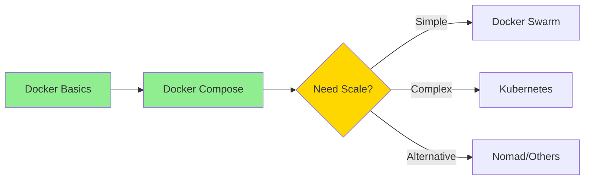

# Module 10: Beyond Docker Compose - Orchestration Preview

> **Duration**: 1 hour  
> **Level**: Intermediate/Advanced Preview  
> **Prerequisites**: Modules 1-8 completed

## 🎯 Learning Outcomes

By the end of this module, you will:

1. **Understand when** Docker Compose isn't enough
2. **Compare orchestration options** (Kubernetes, Swarm, Nomad)
3. **Map Docker concepts** to Kubernetes equivalents
4. **Plan migration paths** from Compose to orchestration
5. **Know what to learn next** in your container journey

## 📚 Module Structure

### When Do You Need Orchestration? (20 min)
- Limitations of Docker Compose
- Scale, resilience, and multi-host challenges
- Real scenarios that require orchestration

### Orchestration Options Overview (20 min)
- **Docker Swarm**: Docker's native orchestration
- **Kubernetes**: Industry standard
- **Nomad**: Lightweight alternative
- Quick comparison matrix

### From Compose to Kubernetes (20 min)
- Concept mapping:
  - `docker-compose.yml` → K8s manifests
  - Services → Deployments & Services
  - Volumes → PersistentVolumeClaims
  - Networks → Network Policies
- Tools to ease transition (Kompose, etc.)

## 🌟 Signs You Need Orchestration

You're ready for orchestration when you need:

1. **High Availability** - Services that can't go down
2. **Auto-scaling** - Handle varying loads automatically
3. **Multi-host deployment** - Beyond single server
4. **Self-healing** - Automatic recovery from failures
5. **Rolling updates** - Zero-downtime deployments
6. **Service mesh** - Advanced networking features

## 📊 Quick Comparison

| Feature | Docker Compose | Docker Swarm | Kubernetes |
|---------|---------------|--------------|------------|
| Learning Curve | Easy | Moderate | Steep |
| Single Host | ✅ Yes | ✅ Yes | ⚠️ Possible |
| Multi Host | ❌ No | ✅ Yes | ✅ Yes |
| Auto-scaling | ❌ No | ⚠️ Basic | ✅ Advanced |
| Ecosystem | Small | Medium | Huge |
| Production Use | Dev/Small | Medium | Enterprise |

## 🗺️ Your Learning Path Forward

## 📝 Note

This module provides a **preview** of orchestration concepts. Full orchestration courses are beyond the scope of this Docker fundamentals path, but this gives you a roadmap for what to learn next.

## 🎓 Key Takeaway

**Docker Compose is perfect for:**
- Development environments
- Small production deployments
- Single-host applications
- Learning and prototyping

**Move to orchestration when you need:**
- Multi-host deployment
- Automatic failover
- Dynamic scaling
- Enterprise features

## 🚀 Next Steps in Your Journey

1. **Master Docker and Compose first** (this course)
2. **Try Docker Swarm** for simple orchestration
3. **Learn Kubernetes basics** when ready for complexity
4. **Explore cloud-native platforms** (EKS, GKE, AKS)

Remember: You don't need Kubernetes for everything! Many successful applications run on Docker Compose.

---

**Congratulations!** You've completed the Docker Learning Path! 🎉
